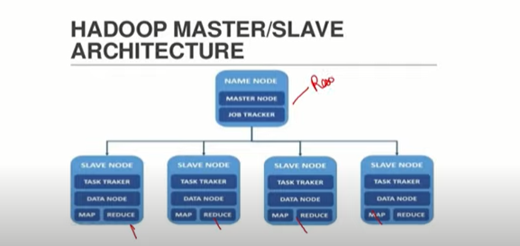

>Big Data is about storing, processing huge
 volume of data with the ultimate end goal
 of generating insights from the data.

>Data can be processed real time or in
batches depending on the solution
requirements.

>Traditional database systems like
relational Databases are not designed to
store, process and analyze huge volume
of data

Bits (5)-1 or 0
Bytes (B)- 8 Bits To store a character
Kilobytes (KB) - 1024 Bytes
Megabytes (MB) - 1024 KB
Gigabytes (GB) - 1024 MB
Terabytes(TB) - 1024 GB
Petabytes(PB) - 1024 TB
Exabytes(FR)- 1024 PR

The 5v of Big data:-
************************************
1.volume-size of data

2.velocity- the speed at which data is generated

3.variety-the different type of data
Structured data - tabular data -grouped
into rows and columns

Semistructured data - Typically key-value
pairs that are grouped into elements
within a file. Data stored in XML and
JSON files

Semistructured data - Typically key-value
pairs that are grouped into elements
within a file. Data stored in XML and
JSON files

4.veracity-the turstworthiness of the data n terms of accuaracy
 
5.value- just having big data is of no use unless we can turn it into value

> big data storage can be done by split the data and saving in different systems in a distributive manner

>Big Data solutions - two key concepts
Distributed Storage
Distributed Computing

HADOOP
*************************
Apache Hadoop is designed to scale up
from single servers to thousands of
machines, each offering local
computation and storage.

   
 
>Hadoop gives the solution for big data
hadoop cluster
1.HDFS(storage unit)(Hadoop Distributed File System ( HDFS ) )
2.Mapreduce(Compute engine)
3.Yarn(resource manager) (YARN stands for Yet Another Resource Negotiator)

>hadoop a java based

HDFS
*****
HDFS distributes a large dataset among
multiple machines with each machine
having its own CPU and RAM

HDFS- Data is stored in block size of
128 MB and each block is replic HE
times (Configurable).
Faut 1olerance
S replicat

>spark cluster
1.hdfs|local|amazon s3
2.spark
3.yarn|mesos|kubernetes

>if we use hdfs,yarn in spark cluster it is called distrubted environment,else we call it standlone environment

PROCESS
source>ingest>process>store>serve data

What is Spark?
>lightning fast real-time processing framework, Written in Scala (JVM).
>For python interface, Py4J library is used
>in-memory computations, Lazy execution and Parallel Processing
>Apache Hadoop Map Reduce was performing batch processing only and lacked
a real-time processing feature. Spark does Batch and Real time processing
>It leverages Apache Hadoop for both storage and processing. It uses HDFS
(Hadoop Distributed File system) for storage and it can run Spark applications
on YARN as wel.
>Spark can load data directly from disk, memory and other data storage
technologies such as Amazon $3, Hadoop Distributed File System (HDFS),
-Hease, Cassandra

HADOOP
MAP REDUCE												
******************
1>Computing Framework Enginé, open source managed by Apache
2>Yes, Map Reduce is Faster than traditional system but it does
not leverage the memory of hadoop cluster to the maximum
3>Map Reduce is disk Oriented completely. Higher latency. No
caching support
4>MapReduce is a cheaper option available while comparing it in
terms of cost.
5>Writing Map reduce pipelines is complex and lengthy as it is
purely Java
6>Batch Processing
7>Fault Tolerance and Highly Scalable and Cross platform
8>Map Reduce has been tested on 15000 nodes
9>it has not inbuilt support to various things like SQL, ML,RT
10>It is basic data processing engine
11>MapReduce runs very well on commodity hardware.

SPARK
*********************
1>Computing Framework Engine, open source managed by Apache
2>spark has been proved to execute the batch processing jobs 10 to 100
times faster
3>Spark ensures lower latency computations by caching the partials results
across its memory of distributed hardware. Stores data in memory
4>As spark requires a lot of RAM to run in-memory. Thus, increases the
cluster, and also its cost.
5>Writing Spark code is always easy and we can write in 4 languages
6>Batch/lterative/ Real Time /Interactive Processing
7>Fault Tolerance and Highly Scalable and Cross platform
8>Spark has been tested on 8000 nodes
9>it has in built support to various things like SQL, ML, RT
10>It is data analytics engine. Hence, it is a choice for Data Scientist.
11>Spark needs mid to high-level hardware.

PYSPARK
**************
>Apache Spark community released a tool, PySpark.
>PySpark is the Python API written in python to support Apache Spark.
>It lets us use the power of Apache Spark in order to tame Big Data.
>It is because of a library called Py4j that they are able to achieve this.
>To use PySpark you will have to install python and Apache spark on your
machine.
>Using PySpark, we can work with RDDs in Python programming language
also.

Pyspark v/s Pandas
*********************
Pyspark
-------------
1>Operation on Pyspark Data Frame run parallel on different
nodes in cluster
2>Operations in PySpark DataFrame are lazy in nature
3>In PySpark RDD, we can't change the DataFrame due to it's immutable property, we need to transform it.
4>PySpark API Supports less type of operations. But it is getting developed
5>Complex operations in PySpark is not easier to perform
6>Pyspark Data Frame Access is Slower but processing is fast
7>setting up Cluster is Required
8>Complicated,

Pandas
---------------------------
1>Pandas will be using ony core of your CPU
2>but, in case of pandas we get the result as soon as we apply any operation.
3>Pandas DF are not immutable in nature
4>Pandas APl su pport more operations than PySparkDataframe. Still pandas API is more powerful than Spark
5>Complex operations in pandas are easiecto itorm
6>Pandas dataframe access is faster but limited to available memory, but processing is slow
7>no need for a cluster
8>simpler, more flexible, more libs, easier to implement

Resilient Distributed Dataset
*************************************
>Fundamental Unit of Pyspark/Spark.
Resilient: It is fault tolerant and is capable of   rebuilding data on failure.

Distributed: Data is distributed among the multiple nodes in a cluster.

Dataset: Collection of partitioned data with values.

>Immutable and follows Lazy transformation

>these are the elements that run and operate on multiple nodes to do parallel
processing on a cluster

>You can apply multiple operations on these RDDs to achieve a ci

>Spark RDD can also be cached and manually partitioned.

>Two Operations: 
            Transformation: to create a new RDD (e.g
                                    and map)
            Action : instructs Spark to perform     computation and send
            the result back to the driver.

FEATURES OF RDD:- 
*********************************
1. In-memory Computation: It stores intermediate results in distributed memory(RAM) instead of stable
storage(disk).
2. Lazy Evaluations All transformations in Apache Spark are lazy, in that they do not compute their results right
away.
3. Fault Tolerance: Spark RDDs are fault tolerant as they track data lineage information to rebuild lost data
automatically.on failure
4. Immutability: Data is safe to share across processes. It can also be created or retrieved anytime which makes
caching, sharing & replication easy. Thus, it is a way to reach consistency in computations.
5. Partitioning: Partitioning is the fundamental unit of parallelism in Spark RDD. Each partition is one logical
division of data which is mutable. One can create a partition through some transformations on existing
partitions.
6. Persistence: Users can state which RDDs they will reuse and choose a storage strategy for them (e.g., in-
memory storage or on Disk).
7.Coarse-grained Operations: It applies to all elements in datasets through maps or filter or group by operation.
8. Location-Stickiness: RDDs are capable of defining placement preference to compute partitions. Placement
preference refers to information about the location of RDD. The DAGScheduler places the partitions in such a
way that task is close to data as much as possible. Thus, speed up computation.

**what 1s the SparkContext:***
Main entry point for Spark functionality to use spark functionality in python environment
A SparkContext represents the connection to a spark clster, and can be used to create RDD's, accumulators
and broadcast variables on that cluster.
Only one SparkContext may be active per JVM.
You mustt stop() the active SparkContext before creating a new one.

